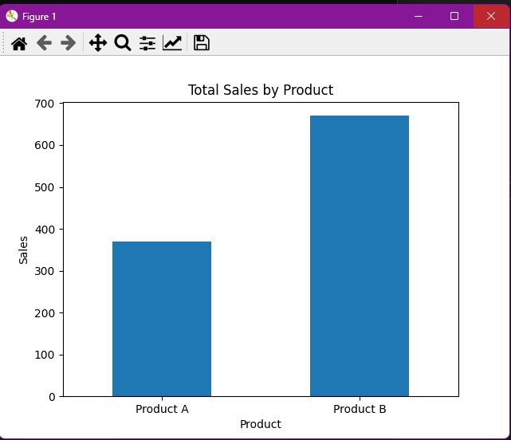
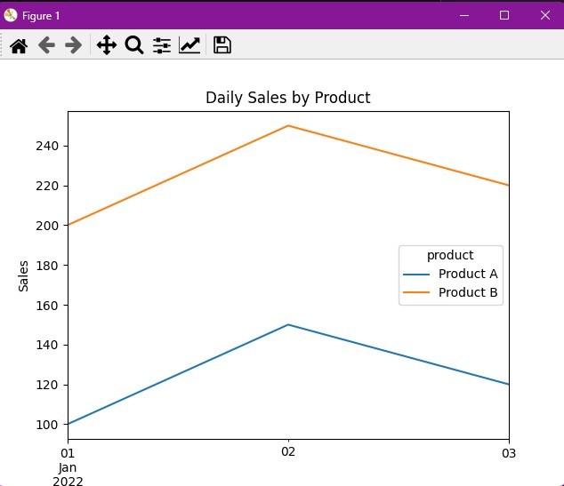
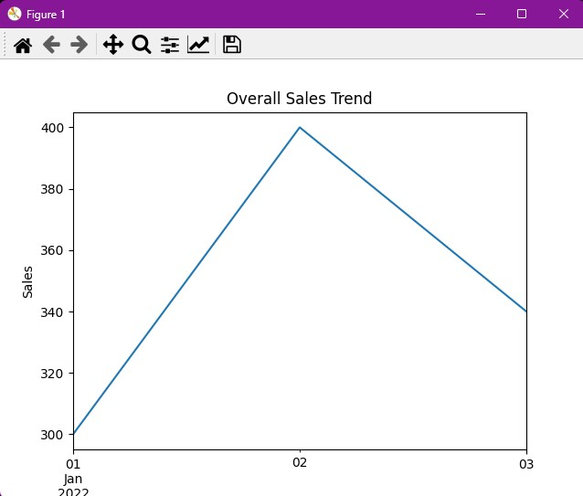

# Sales Data Visualization

This is a Python project that loads sales data from a CSV file and creates visualizations of the data using the Pandas and Matplotlib libraries.

## Data

The data used in this project is stored in a CSV file located in the `Data` directory. The file contains sales data for a number of products over a period of time. The columns in the file are:

- `date`: the date of the sale
- `product`: the name of the product sold
- `sales`: the total number of sales for the product on that date

## Usage

To use this project, you will need to have Python and the following libraries installed:

- pandas
- matplotlib

You can install these libraries using the following command:
```
pip install pandas matplotlib
```
To run the project, simply execute the `sales_visualization.py` script:
```
python sales_visualization.py
```
The script will generate three charts:

1. A bar chart showing the total sales for each product
2. A line chart showing the daily sales for each product
3. A line chart showing the overall sales trend for the time period

## Screenshots

### Total Sales by Product



### Daily Sales by Product



### Overall Sales Trend



## License

This project is licensed under the MIT License. See the [LICENSE](LICENSE) file for details
